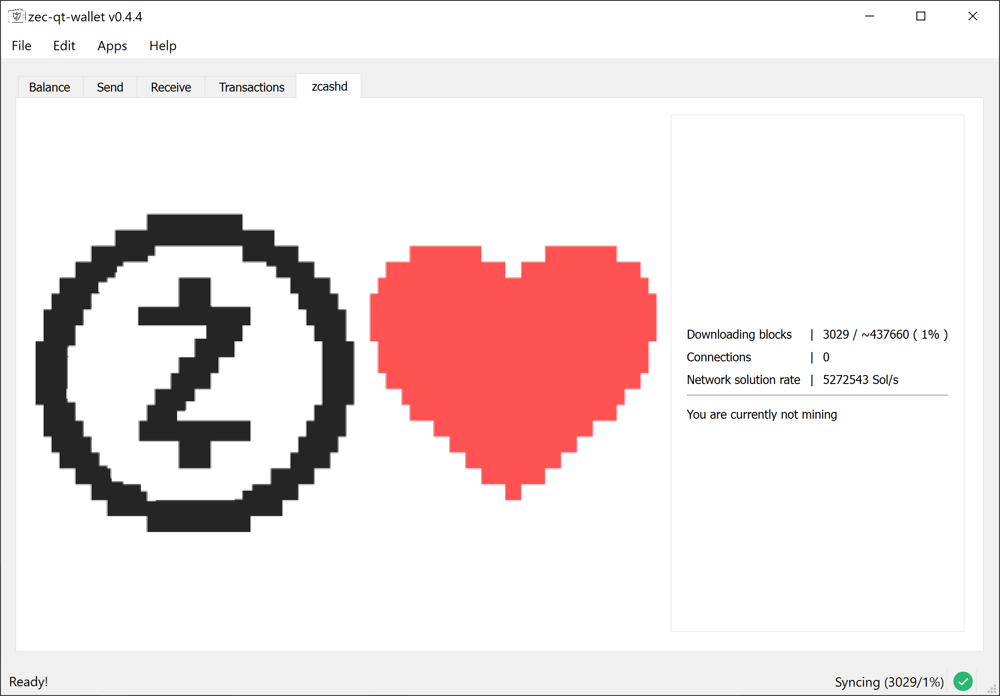

# zec-qt-wallet Documentation

---

**zec-qt-wallet** is a z-Addr first, Sapling compatible wallet and full node for `zcashd` that runs on Linux, Windows and macOS.

See [**Contributing**](/CONTRIBUTING.md) for how to build, test and deploy the documentation.  

_zec-qt-wallet is NOT an official wallet, and is not affiliated with the Zerocoin Electric Coin Company in any way._