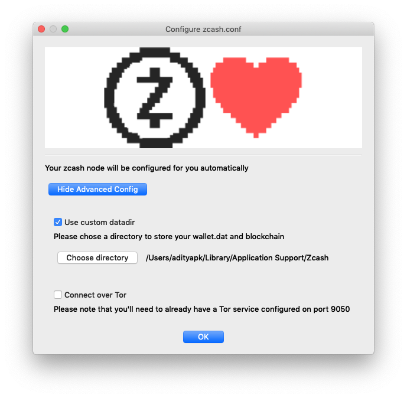

# FAQ
---

## Installation

### Where do I download the software?

zec-qt-wallet is available to download from the [Zcash Foundation Github repository](https://github.com/ZcashFoundation/zec-qt-wallet). The [releases page](https://github.com/ZcashFoundation/zec-qt-wallet/releases) lists the latest available downloads for each platform.

The Android application, which is still in beta, may be downloaded [from here](https://github.com/adityapk00/zqwandroid/releases).

### Which installer should I download?

See the [installation](/installation/#download-and-install) section for more details specific for your platform.

### How do I verify the download file?

// TODO update this once signed releases are pushed

## Blockchain

### Is zec-qt-wallet a light client?

No, zec-qt-wallet requires a full `zcashd` node to operate. A [light client protocol](https://z.cash/blog/zcash-reference-wallet-light-client-protocol/) is currently in development that would substantially reduce the storage and bandwidth requirements for a light wallet.

### How large is the blockchain?

Currently, the blockchain data directory is around 22GB (Feb 2019) and will continue to grow with time.

### Can I change the location of the data directory?

If you are starting zec-qt-wallet for the first time, then you can choose the advanced configuration and select the location of your data directory, which may, for example, be on a separate disk. 



If you have an existing data directory you would like to move, it you can achieve this through the following steps, with zec-qt-wallet closed:

* Create the new directory
* Copy everything in your [existing data directory](/faq/#where-is-the-default-data-directory-on-each-platform) to the new location
* Update [zcash.conf](/using-zec-qt-wallet/#customising-zcashconf) to add the line `datadir=/your/new/path` specifying the path to the newly created folder
* Restart zec-qt-wallet

### Can I move the params directory?

No, unlike the data directory there is no configurable option to specify the params directory and `zcashd` expects the params directory to be in the following locations:

* Windows: `%HOMEPATH%\AppData\Roaming\ZcashParams`
* macOS: `~/Library/Application Support/ZcashParams`
* Linux: `~/.zcash-params`

The folder should contain the following files and all are (currently) required for `zcashd` to function.

```
3.5M sapling-output.params
46M  sapling-spend.params
692M sprout-groth16.params
869M sprout-proving.key
1.5K sprout-verifying.key
```

As a workaround, you can use any filesystem operations for your OS, e.g. creating a symlink of the directory but these are unsupported.

## Transactions

### Can I use funds with zero confirmations?

No, Zcash requires that you have at least 1 confirmation before sending. Trying to spend unconfirmed funds will [result in an error](/troubleshooting/#not-enough-balance-when-sending-transactions).

### Can I use a custom fee?

Yes, though it is advised to use the default 0.0001 fee to prevent your transactions from being distinguishable, you may override this behaviour in the app [**Options**](/using-zec-qt-wallet/#zeq-qt-wallet-options).

### What's the difference between Transparent, Sprout and Sapling addresses?

Transparent addresses start with a **t** prefix and are transparent like Bitcoin and offer no privacy properties. Sprout addresses have a **zc** prefix and are the first generation of shielded addresses. Sprout addresses have been superseded by Sapling addresses which have a **zs** prefix. While Sprout addresses may still be used it is recommended to use Sapling addresses due to the [performance improvements](/faq/#how-long-does-a-sapling-transaction-take). To move funds between Sprout and Sapling addresses see the [turnstile migration documentation](/turnstile-migration/). For more detailed information on the types of addresses in Zcash [see this page](https://zcash.readthedocs.io/en/latest/rtd_pages/addresses.html).

Note that on testnet transparent addresses have a prefix **tm**, Sprout have a **zt** prefix and Sapling **ztestsapling**.

### How long does a Sapling transaction take?

Sapling greatly reduced the time taken to perform shielded proofs down to just a few seconds though this value does depend on hardware and the number of shielded inputs/outputs. Sending from a transparent address to a Sapling one is typically completed in under 0.5 seconds. Legacy Sprout transactions take in the order of 70-90 seconds but this is also dependent on hardware and the number of JoinSplits. For more information see [this post](https://z.cash/blog/reducing-shielded-proving-time-in-sapling/).

## zcashd node

### Where is the default data directory on each platform?

By default the location of the data directory, which stores the wallet, `zcash.conf` and all blockchain data, is found in the following locations. It is possible to [move this data directory](/faq/#can-i-change-the-location-of-the-data-directory).

* Windows: `%HOMEPATH%\AppData\Roaming\Zcash\zcash.conf`
* macOS: `~/Library/Application Support/Zcash/zcash.conf`
* Linux: `~/.zcash/zcash.conf`

### Where is `zcash.conf` located?

`zcash.conf` is located in the [default data directory](/faq/#where-is-the-default-data-directory-on-each-platform) and will be in this location even if the `datadir` parameter has been set to a custom value.

### Can I use zec-qt-wallet with an external node?

Yes, see [this section](/using-zec-qt-wallet/#connecting-to-an-external-zcashd) for how to connect to an external `zcashd`.

### How do I find the version of zcashd that I am running?

To find the version of `zcashd` you are running simply hover over the blockchain data in the lower right hand corner and a popup will appear with the `zcashd` version string:


### Does zec-qt-wallet work on testnet?

Yes, zec-qt-wallet will work with testnet. To do so add the following lines to your [zcash.conf](using-zec-qt-wallet/#customising-zcashconf) file, replacing the existing values if present:

``` bash
addnode=testnet.z.cash
testnet=1
```

### Does zec-qt-wallet support selective disclosure?

Not yet. While [selective disclosure](https://z.cash/blog/viewing-keys-selective-disclosure/) works on Sprout addresses, `zcashd` has not yet been updated to support Sapling addresses. There is [a plan to support this](https://github.com/ZcashFoundation/zec-qt-wallet/issues/47) once implemented by `zcashd`.

### Does zec-qt-wallet support viewing keys?

No as `zcashd` doesn’t currently support Sapling viewing keys and will be implemented in zec-qt-wallet once supported.

## Wallet

### Is the wallet encrypted?

No, wallet encryption is [currently disabled](https://github.com/zcash/zcash/blob/master/doc/security-warnings.md#wallet-encryption) by `zcashd`. You should use full-disk encryption (or encryption of your home directory) to protect your `wallet.dat` file at rest, and should assume (even unprivileged) users who are running on your OS can read your `wallet.dat` file.

### Why does my change go to a new address?

Like Bitcoin when using transparent addresses, change from a transaction goes to a new transparent address. zec-qt-wallet allows you to set an option to automatically send this change to a Sapling address via the application [**Options**](/using-zec-qt-wallet/#zeq-qt-wallet-options). As this was added in Bitcoin as a measure to preserve privacy and prevent trivial linking of transactions on the blockchain, shielded (z) addresses do not have this property and any change is returned to the sending (z) address.

### Will zec-qt wallet remember my outgoing shielded sends?

Yes, by default zec-qt-wallet will store shielded sends locally as `zcashd` does not provide this information. You can override this behaviour via the [**Options**](/using-zec-qt-wallet/#zeq-qt-wallet-options) setting and you can remove any stored transactions at any time by choosing the **Clear History** button (note that these will not be later recoverable if you delete them).

### How do I read a memo?

If there is a [memo](/using-zec-qt-wallet/#encrypted-memo-field) attached to a transaction then it will be visible by a message icon by the transaction. Simply right-click the transaction and choose **View Memo**.


### Can I use zec-qt-wallet with a hardware wallet?

No, this is currently not supported.

### Can I remove an address from the wallet?

No, addresses cannot be removed from the wallet. It is advised that you [export the private keys](/using-zec-qt-wallet/#export-a-single-private-key) for addresses you are interested in and then delete the `wallet.dat` file. You can then [import the private keys](/using-zec-qt-wallet/#importing-private-keys) you require in a fresh, empty wallet.

### Seed phrases

//TODO

#### Can zec-qt-wallet export a 12/18/24 word seed

//TODO

No, `zcashd` does not support BIP xxx. Sapling does use a HD wallet xxx https://z.cash/blog/sapling-in-hd/

https://github.com/zcash/zcash/issues/2673

#### Where can I find the Sapling HD seed?

https://z.cash/blog/sapling-in-hd/

In zcashd only Sapling addresses are HD compatible. There is a Sapling master seed but this is currently not accessible to the zec-qt-wallet. To get this seed you need to run the following command via the zcashd CLI. `zcash-cli z_exportwallet` having set an export path in your `zcash.conf`. The Sapling seed will be displayed at the top of the file in the format...

#### Can I import a Sapling HD seed

It should be noted that it is currently not possible to _import_ the seed to zcashd but this functionality will be enabled shortly.

### Can I mine with zec-qt-wallet?

No, zec-qt-wallet is a wallet and full node. while you can configure zcashd to run the inbuilt CPU miner this isn't practical to run on mainnet and you need alternative hardware and software to run. See this page for more information on mining https://www.zcashcommunity.com/mining/

## WinZEC

### How do I upgrade from WinZEC?

WinZEC has now been deprecated. You can simply install zec-qt-wallet and it'll use the existing data directory and wallet from WinZEC and operate as normal.

### Can I import the WinZEC address book?

Yes, browse to the location of the address book file. By default this will be `%HOMEPATH%\AppData\Local\ZcashSwingWalletUI\addressBook.csv` where `%/HOMEPATH%` is typically `C:\Users\YourUsername\` and you may need to enable viewing hidden files to browse to the `AppData` folder location.


## In what languages is zec-qt-wallet available?

Currently, it is available in Frech, Spanish and Portuguese. If you want to help by translating see the [Translating zec-qt-wallet](/translations/) page.